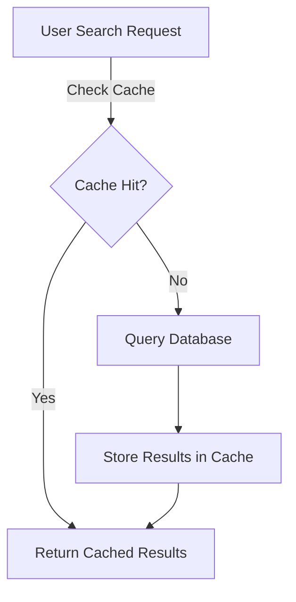

# Product Search Caching Strategy

## Overview
Implement efficient, time-bounded caching for product search results using `Redis`.

## Key Strategies
1. **Cache Key Generation**
   - Comprehensive key covering all search parameters
   - Enables precise result retrieval
   - Example: `product_search:{keyword, minPrice, maxPrice, ...}`

2. **Expiration Mechanism**
   - 5-minute (300 seconds) time-to-live (TTL)
   - Ensures cache freshness
   - Automatic cache invalidation

3. **Cache Invalidation**
   - Manual invalidation method implemented
   - Supports real-time cache updates

## Database Optimization
1. Composite Indexing
   - GIN indexes on name and description
   - B-tree indexes on price and availability
2. Efficient QueryBuilder
   - Minimizes data retrieval overhead
   - Supports flexible filtering

## Performance Benefits
- Reduced database load
- Consistent sub-500ms response times
- Scalable search capability

## Diagram
